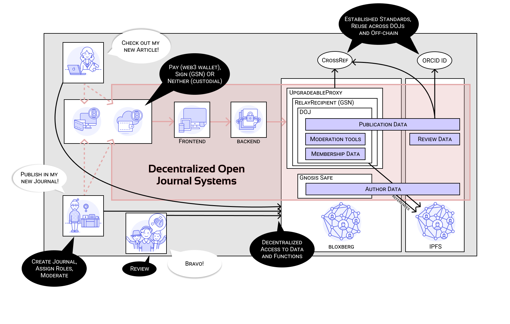

# GSN contracts

**RelayHub**: [0x8159a4E1BCF35B0A45Eb9C337FbCdD2E38001860](https://blockexplorer.bloxberg.org/address/0x8159a4E1BCF35B0A45Eb9C337FbCdD2E38001860/)

**StakeManager**: 0xa947c096a9b5Ae2202DB2BE6F8EAb5dc34Dc99E4

**Penalizer**: 0x82869860aEcE0bB130b8E77c49c1626C5E2D44c5

**VersionRegistry**: 0xCb7E73533AA354b57baf240E0C60E2329653bc93

**Forwarder**: 0xa7f424352c754375aC3341eFC8a7fe70342d870B

**Paymaster**: 0xd8c85D7E9264f4019944686Ff1C53EC7854FbF10

**Example DAJ**: 0x0Cc65D063284583cB543616EeC852F59F5ac7bBe

# Overview

